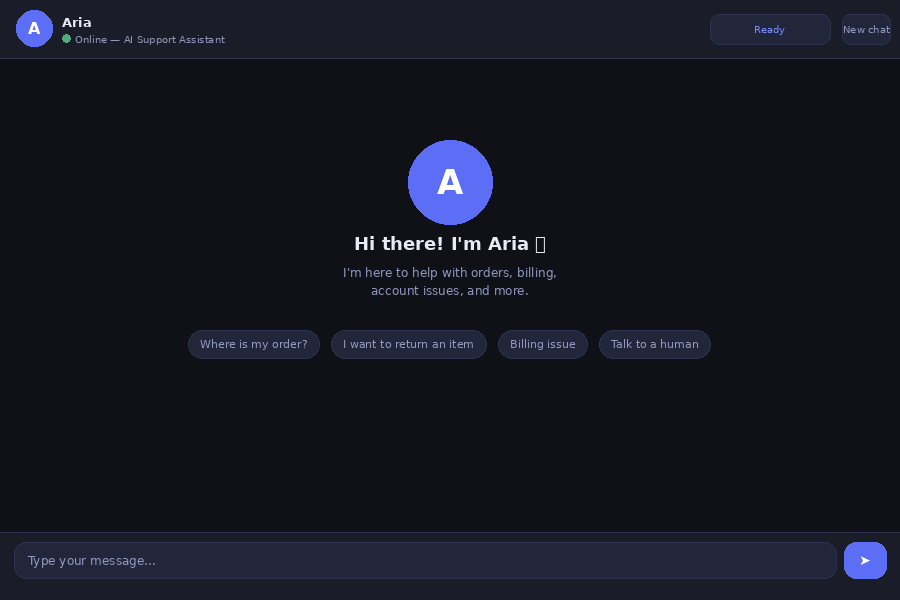
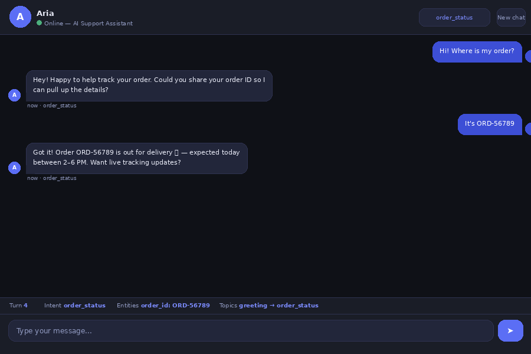
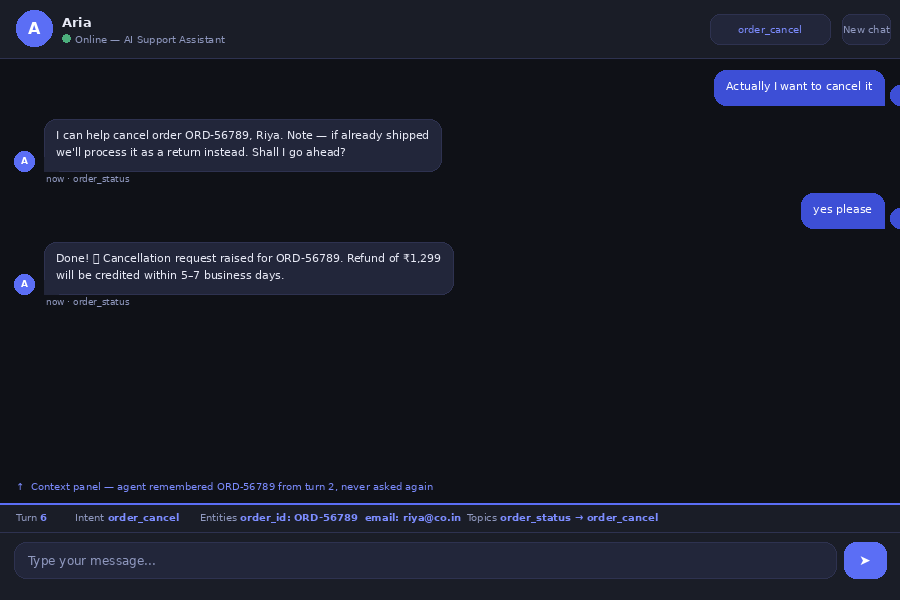
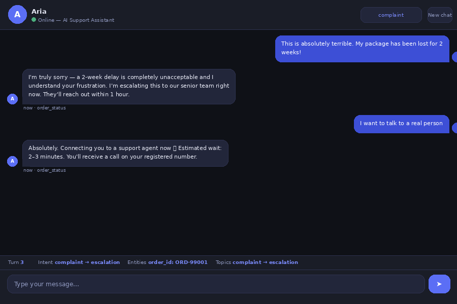

# Aria — Context-Aware AI Support Chatbot

A production-grade conversational chatbot built with **FastAPI + Claude/GPT-4o**.  
Maintains full multi-turn context, recognises user intent, extracts entities, and handles coherent dialogue like a real support assistant.

---

## Demo

### Welcome Screen


### Order Tracking — Multi-Turn Conversation


### Context Memory in Action

> Notice the context bar at the bottom — the agent remembered `ORD-56789` from turn 2 and never asked again when the user said "cancel it" in turn 5.

### Complaint Detection + Escalation

> When frustration is detected, Aria empathises first before solving — and handles escalation to a human agent seamlessly.

---

## What Makes This Different

Most chatbot demos just pipe messages to an LLM and call it done.  
This project is built the way a real company would build it:

| Feature | What It Does |
|---|---|
| **Context Window Management** | Keeps last 20 turns in full; condenses older turns into a summary injected into every LLM call |
| **Entity Extraction** | Automatically picks up order IDs, emails, phone numbers from conversation |
| **Intent Recognition** | Two-tier system — fast keyword matching + contextual inheritance for ambiguous messages |
| **Fallback Handling** | If the AI call fails, returns a graceful error message instead of crashing |
| **Session Management** | Each user gets a session ID; full history retrievable via REST API |
| **Provider Agnostic** | Swap Claude ↔ GPT-4o by changing one env variable |

---

## Project Structure

```
aria-chatbot/
├── main.py                   # FastAPI app, routes, session store
├── core/
│   ├── context_manager.py    # Multi-turn memory, entity extraction
│   ├── intent_recognizer.py  # Two-tier intent classification
│   └── ai_service.py         # Claude / OpenAI API wrapper
├── static/
│   └── index.html            # Chat UI (single file, no build step)
├── demo1_welcome.png         # Screenshot — welcome screen
├── demo2_order.png           # Screenshot — order tracking flow
├── demo3_context.png         # Screenshot — context memory
├── demo4_complaint.png       # Screenshot — complaint + escalation
├── requirements.txt
├── .env.example
├── Procfile                  # For Railway / Render deployment
└── README.md
```

---

## Local Setup

```bash
# 1. Clone
git clone https://github.com/M-K-Chaitanya/Context-Aware-Conversational-Chatbot.git
cd aria-chatbot

# 2. Create virtual environment
python -m venv venv
source venv/bin/activate        # Windows: venv\Scripts\activate

# 3. Install dependencies
pip install -r requirements.txt

# 4. Set up environment variables
cp .env.example .env
# Edit .env and add your API key

# 5. Run
uvicorn main:app --reload --port 8000

# 6. Open browser
# http://localhost:8000
```

---

## Environment Variables

| Variable | Description |
|---|---|
| `AI_PROVIDER` | `anthropic` or `openai` |
| `ANTHROPIC_API_KEY` | Your Claude API key from console.anthropic.com |
| `OPENAI_API_KEY` | Your OpenAI key (only if using GPT-4o) |

---

## API Reference

### POST /chat

**Request:**
```json
{
  "session_id": "optional-existing-session-id",
  "message": "Where is my order ORD-12345?",
  "user_name": "Riya"
}
```

**Response:**
```json
{
  "session_id": "abc-123",
  "reply": "Hi Riya! Let me look up order ORD-12345 for you...",
  "intent": "order_status",
  "turn_number": 3,
  "context_summary": {
    "user_name": "Riya",
    "turn_count": 3,
    "entities": { "order_id": "ORD-12345" },
    "topic_history": ["greeting", "order_status"],
    "last_intent": "order_status"
  }
}
```

### GET /session/{session_id}/history
### DELETE /session/{session_id}
### GET /health

---

## How Context Memory Works

```
Turn 1:  User: "Hi, I'm having an issue with my order"
         → Intent: order_status, entity extraction starts

Turn 2:  User: "It's ORD-78291"
         → Entity extracted: order_id = ORD-78291

Turn 3:  User: "I want to return it"
         → Intent: order_return
         → order_id already known — agent doesn't ask again

Turn 4:  User: "yes"
         → Short message → contextual inheritance → return confirmed
```

---

## Intent Categories

| Intent | Triggers |
|---|---|
| `order_status` | track, where is my order, delivery |
| `order_return` | return, refund, exchange |
| `order_cancel` | cancel order |
| `billing` | invoice, charge, payment, subscription |
| `tech_support` | not working, error, broken |
| `escalation` | speak to human, manager, agent |
| `complaint` | terrible, awful, unacceptable |
| `greeting` | hi, hello, hey |
| `farewell` | bye, goodbye |

---

## Deploy to Railway (Free)

```bash
npm install -g @railway/cli
railway login
railway init
railway up
# Set AI_PROVIDER + ANTHROPIC_API_KEY in Railway dashboard
```

---

## Tech Stack

- **Backend:** FastAPI (Python)
- **AI:** Anthropic Claude Sonnet / OpenAI GPT-4o
- **Context:** Custom in-memory ContextManager (Redis-ready)
- **Frontend:** Vanilla HTML/CSS/JS (zero build step)
- **Deploy:** Railway / Render / any Python host
